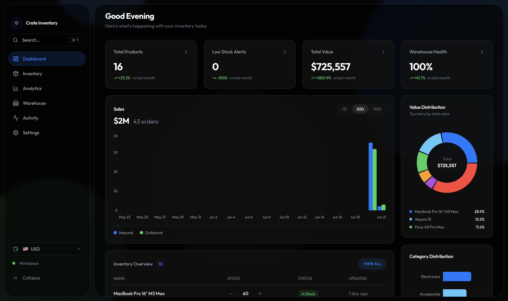
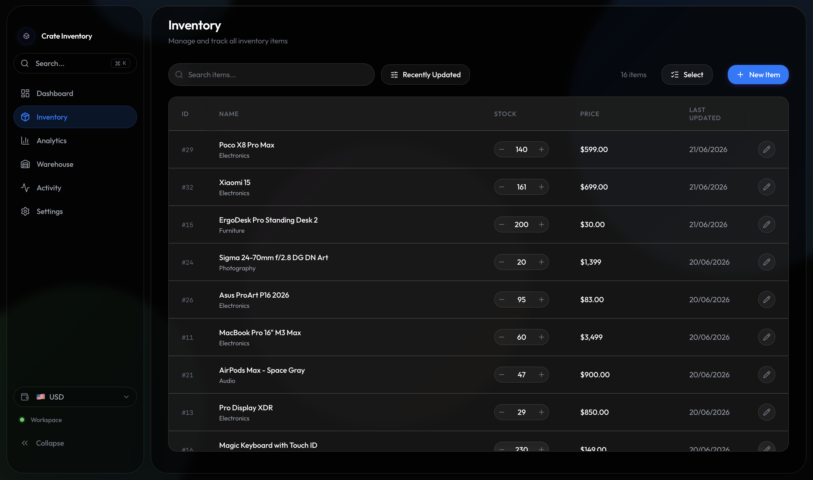
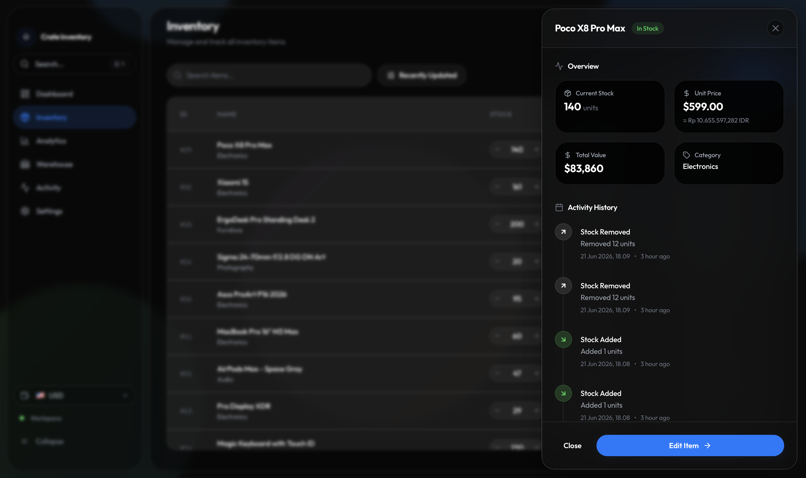
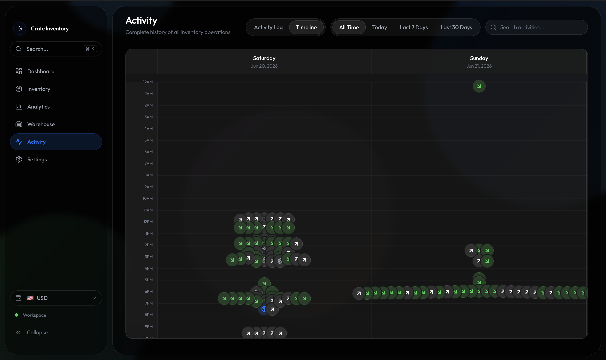

<h1 align="center">Crate</h1>

<p align="center">
  <strong>Inventory intelligence for the modern supply chain.</strong>
</p>

<p align="center">
  Crate is a high-performance, real-time inventory management platform designed to bring clarity and precision to stock operations. It combines a sleek, modern interface with robust underlying architecture to provide absolute visibility into your warehouse operations, pricing history, and stock movement.
</p>

<br />

## Overview

Crate is built for modern operations teams and businesses that require a sophisticated yet highly accessible way to manage their inventory. It solves the fragmentation problem of traditional inventory systems by uniting product catalogs, stock tracking, warehouse organization, and real-time analytics into a single, cohesive ecosystem.

By prioritizing speed, usability, and data accuracy, Crate ensures that you always know exactly what you have, where it is, and how its value is changing.

## Features

### Inventory Management
- **Product Catalog**: Centralized database of all products with detailed metadata.
- **Advanced Search**: Instantly find products across thousands of SKUs.
- **Filtering & Sorting**: Drill down into specific categories or stock levels.
- **Stock Management**: Effortlessly adjust stock levels, track capacities, and prevent stockouts.

### Stock Intelligence
- **Stock Movement History**: Immutable ledger of all inbound and outbound stock transactions.
- **Inventory Activity Timeline**: Chronological, real-time feed of all warehouse events.
- **Inventory Insights**: Actionable analytics on fast-moving items, dead stock, and demand trends.

### Pricing
- **Price Tracking**: Maintain historical records of pricing adjustments over time.
- **Dynamic Pricing**: Single source of truth for base prices.
- **Multi-currency Support**: Seamless global currency switching (USD and IDR) with real-time exchange rates.

### Warehouse
- **Warehouse Organization**: Define and manage distinct storage zones and aisles.
- **Inventory Location Management**: Accurately map products to physical warehouse locations.
- **Capacity Monitoring**: Visual indicators for zone capacities to prevent overstocking.

### Productivity
- **Command Palette**: Lightning-fast, keyboard-first workflow for power users (Cmd+K).
- **Quick Actions**: Rapidly execute common tasks without navigating away from your current view.
- **Bulk Operations**: Edit multiple products simultaneously to save time.

## Tech Stack

| Component | Technology | Description |
|-----------|------------|-------------|
| **Frontend** | React | Core UI framework for building interactive components. |
| **Language** | TypeScript | End-to-end type safety and developer experience. |
| **Styling** | Tailwind CSS | Utility-first styling for a highly custom, modern aesthetic. |
| **Database** | Supabase | PostgreSQL-backed database with real-time subscriptions. |
| **Icons** | Lucide React | Clean, consistent iconography throughout the application. |

## Architecture

Crate is built on a robust relational data model designed for scale and auditability:

- **Products**: The core entities representing physical goods. Each product holds its base price and current aggregated stock count.
- **Stock Movements**: Tracked completely separately from the products themselves. Every change in stock (inbound or outbound) creates an immutable ledger entry. This ensures absolute traceability and prevents silent stock discrepancies.
- **Activity Logs**: A separate system that records all user and system actions (e.g., price updates, product creation), forming the backbone of the activity timeline.
- **Warehouses**: Spatial architecture allowing for precise mapping of inventory to physical zones and capacity limits.

**Single Source of Truth Philosophy**: Crate enforces a strict single source of truth for pricing. Base prices are stored in a primary currency (USD), and all other currency displays are computed dynamically on the client side. This prevents data fragmentation and ensures consistency across the entire platform.

## Screenshots

### Dashboard


### Inventory


### Product Detail Drawer


### Activity Timeline


### Analytics


## Getting Started

### Prerequisites
- Node.js (v18 or higher)
- npm or yarn
- A Supabase account

### Installation

1. Clone the repository:
```bash
git clone https://github.com/bharaaa/b-inventory-management.git
cd b-inventory-management
```

2. Install dependencies:
```bash
npm install
```

### Environment Variables

Create a `.env` file in the root directory and add your Supabase credentials:

```env
# Your Supabase project URL (e.g., https://xyzcompany.supabase.co)
VITE_SUPABASE_URL=your_supabase_url

# Your Supabase public anonymous key for client-side authentication
VITE_SUPABASE_ANON_KEY=your_supabase_anon_key
```

### Development Server

Start the local development server:
```bash
npm run dev
```

### Build Commands

Create a production-ready build:
```bash
npm run build
```

Preview the production build locally:
```bash
npm run preview
```

## Folder Structure

```text
src/
├── components/   # Reusable UI components organized by feature (inventory, dashboard, etc.)
├── contexts/     # React contexts for global state management (Currency, Drawers, etc.)
├── features/     # Encapsulated feature modules
├── helpers/      # Utility functions and formatters
├── hooks/        # Custom React hooks encapsulating complex logic
├── pages/        # Top-level route components
├── services/     # API clients and external service integrations (Supabase, Exchange Rates)
├── types/        # Global TypeScript interfaces and type definitions
└── utils/        # General helper scripts
```

## Future Roadmap

- **Advanced Inventory Forecasting**: Predictive models to anticipate stockouts before they happen.
- **AI-powered Inventory Insights**: Automated recommendations for reorder points and dead stock liquidation.
- **Multi-warehouse Support**: Scale operations across multiple physical distribution centers.
- **Bulk Product Operations**: Enhanced workflows for mass updates and inventory reconciliation.
- **Import/Export Workflows**: Seamless integration with external ERPs and accounting software via CSV/Excel.

## Design Philosophy

Crate is designed to be **clean, fast, and data-driven**. Inspired by modern SaaS products like Linear and Stripe, the interface intentionally avoids visual clutter, favoring a minimalist "Liquid Glass" aesthetic that surfaces critical data immediately. 

The application prioritizes usability and speed over unnecessary visual complexity. Micro-interactions, dynamic currency conversions, and keyboard shortcuts (like the Command Palette) are built-in to ensure that operations teams can execute their tasks with minimal friction and maximum confidence.